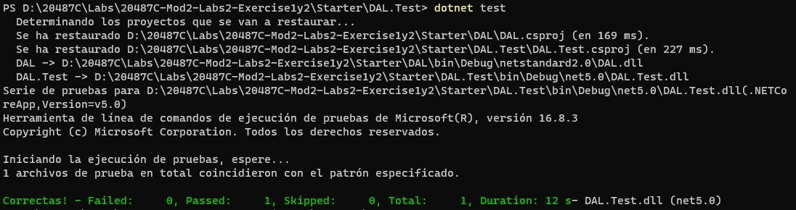
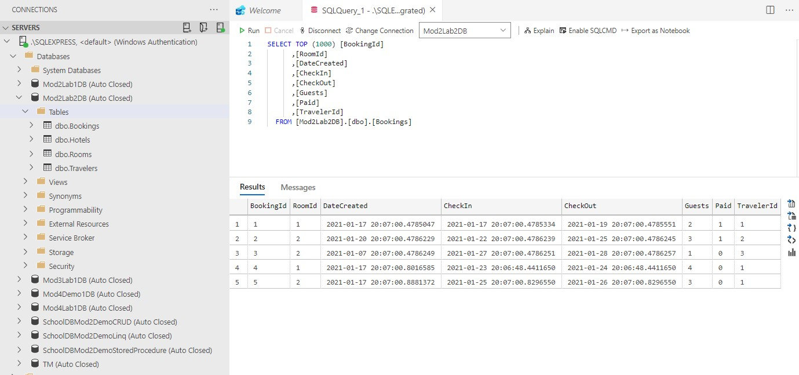
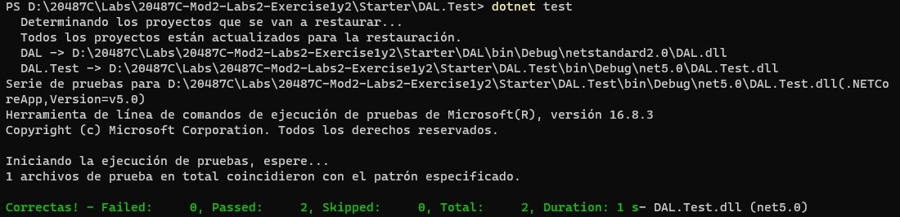
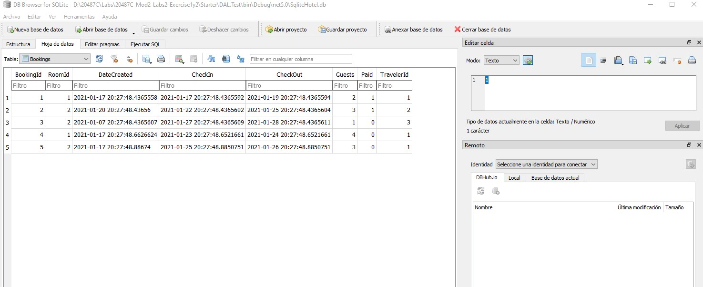

# Module 2: Querying and Manipulating Data Using Entity Framework

# Lab: Manipulating Data

1. **Nombres y apellidos:** Francisco Javier Moreno Quevedo
2. **Fecha:** 17/01/2021
3. **Resumen del Ejercicio:**  Completar el proyecto para poder manipular los datos
4. **Dificultad o problemas presentados y como se resolvieron:**Ninguna


#### Exercise 1: Create repository methods

- Abrimos el proyecto **Lab2** en VSC

- Añadimos en **HotelBookingRepository.cs** añadimos un constructor por defecto sin parametros

  ```cs
  private DbContextOptions<MyDbContext> _options;
  
  public HotelBookingRepository()
   {
       _options = new DbContextOptionsBuilder<MyDbContext>()
           .UseSqlServer(@"Server=.\SQLEXPRESS;Database=Mod2Lab2DB;Trusted_Connection=True;")
           .Options;
   }
  ```

- Añadimos en **HotelBookingRepository.cs **añadimos un segundo constructor donde inyectamos dbcontextoptions

  ```cs
   public HotelBookingRepository(DbContextOptions<MyDbContext> options)
   {
       _options = options;
   }
  ```

- Añadimos en **HotelBookingRepository.cs** la tarea Add

  ```cs
   public async Task<Booking> Add(int travelerId, int roomId, DateTime checkIn, int guest = 1)
   {
       using (MyDbContext context = new MyDbContext(_options))
       {
           Traveler traveler = context.Travelers.FirstOrDefault(t => t.TravelerId == travelerId);
           Room room = context.Rooms.FirstOrDefault(r => r.RoomId == roomId);
           if (traveler != null && room != null)
           {
               Booking newBooking = new Booking()
               {
                   DateCreated = DateTime.Now,
                   CheckIn = checkIn,
                   CheckOut = checkIn.AddDays(1),
                   Guests = guest,
                   Paid = false,
                   Traveler = traveler,
                   Room = room
               };
               Booking booking = (await context.Bookings.AddAsync(newBooking))?.Entity;
               await context.SaveChangesAsync();
               return booking;
           }
           return null;
       }
   }
  ```


- Añadimos en **HotelBookingRepository.cs** la tarea update

   ```cs
    public async Task<Booking> Update(Booking bookingToUpdate)
    {
        using (MyDbContext context = new MyDbContext(_options))
        {
            Booking booking = context.Bookings.Update(bookingToUpdate)?.Entity;
            await  context.SaveChangesAsync();
            return booking;
        }
    }
   ```

- Añadimos en **HotelBookingRepository.cs** la tarea delete

   ```cs
    public async void Delete(int bookingId)
    {
        using (MyDbContext context = new MyDbContext(_options))
        {
            Booking booking = context.Bookings.FirstOrDefault(b => b.BookingId == bookingId);

            if (booking != null)
            {
                context.Bookings.Remove(booking);
                await context.SaveChangesAsync();
            }
        }
    }
   ```


#### Exercise 2: Test the model using SQL Server and SQLite

- Creamos el proyecto DAL.Test

```bash
dotnet new mstest --name DAL.Test
```

- Añadimos el proyecto a la solucion

```bash
dotnet sln Mod2Lab2.sln add DAL.Test\DAL.Test.csproj
```

- En **DAL.Test.csproj**. Añadimos la referencia al proyecto **DAL** 

```xml
<ItemGroup>
     <ProjectReference Include="..\DAL\DAL.csproj" />
</ItemGroup>
```

- Renombramos **UnitTest1.cs** por **BookingRepositoryTests**.

- Añadimos los using

```cs
using System.Transactions;
using System;
using DAL.Repository;
using DAL.Models;
using DAL.Database;
using System.Threading.Tasks;
using System.Linq;
using Microsoft.EntityFrameworkCore;
```

- Cambiamos **public void TestMethod1()** a **public async Task AddTwoBookingsTest()**.

- Añadimos dos reservas

   ```cs
    Booking fristBooking;
    Booking secondBooking;
    using (TransactionScope scope = new TransactionScope(TransactionScopeOption.Required,
            new TransactionOptions { IsolationLevel = IsolationLevel.ReadCommitted }, TransactionScopeAsyncFlowOption.Enabled))
    {
        HotelBookingRepository repository = new HotelBookingRepository();
        fristBooking = await repository.Add(1, 1, DateTime.Now.AddDays(6), 4);
        secondBooking = await repository.Add(1, 2, DateTime.Now.AddDays(8), 3);
        scope.Complete();
    }

    using (MyDbContext context = new MyDbContext())
    {
        int bookingsCounter = context.Bookings.Where(booking => booking.BookingId == fristBooking.BookingId ||
                                                                booking.BookingId == secondBooking.BookingId).ToList().Count;
        Assert.AreEqual(2, bookingsCounter);
    }
   ```

1. 

- Testeamos el metodo **AddTwoBookingsTest** 

```bash
dotnet test
```



- Abrimos **Azure Data Studio**.

- COmprobamos que se ha creado la BD Mod2Lab2DB y que tiene las reservas



#### 

- Añadimos el paquete **Entity Framework Core SQlite**

```base
 dotnet add package Microsoft.EntityFrameworkCore.Sqlite --version=2.1.1
```

- Restauramos

```base
 dotnet restore
```

- En **BookingRepositoryTests.cs**. al principio de la clase insertamos el proveedor SQLite


```cs
  private DbContextOptions<MyDbContext> _options =
            new DbContextOptionsBuilder<MyDbContext>()
                .UseSqlite(@"Data Source = [Repository Root]\Allfiles\Mod02\LabFiles\Lab2\Database\SqliteHotel.db")
                .Options;
```


- Añadimos la tarea asincrona **AddTwoBookingsSQLiteTest**

```cs
  [TestMethod]
     public async Task AddTwoBookingsSQLiteTest()
     {
         using (MyDbContext context = new MyDbContext(_options))
         {

             HotelBookingRepository repository = new HotelBookingRepository(_options);
             Booking fristBooking = await repository.Add(1, 1, DateTime.Now.AddDays(6), 4);
             Booking secondBooking = await repository.Add(1, 2, DateTime.Now.AddDays(8), 3);

             int bookingsCounter = context.Bookings.Where(booking => booking.BookingId == fristBooking.BookingId ||
                                                                     booking.BookingId == secondBooking.BookingId).ToList().Count;

             Assert.AreEqual(2, bookingsCounter);
         }
     }
```

- Testeamos

  

  

